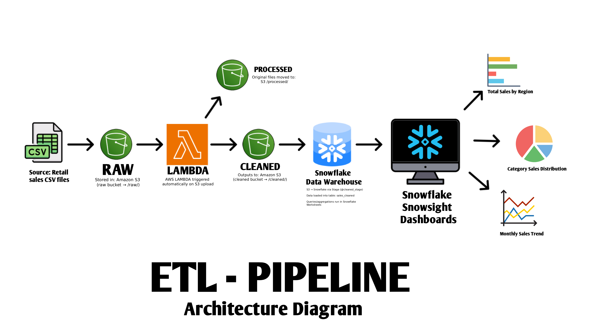
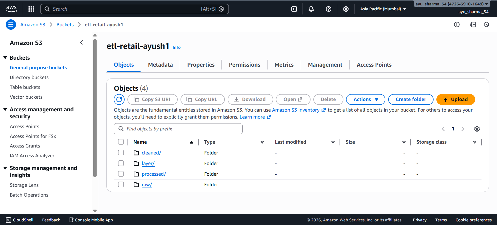
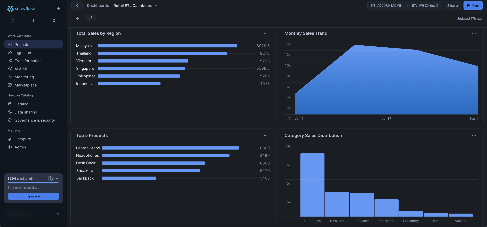
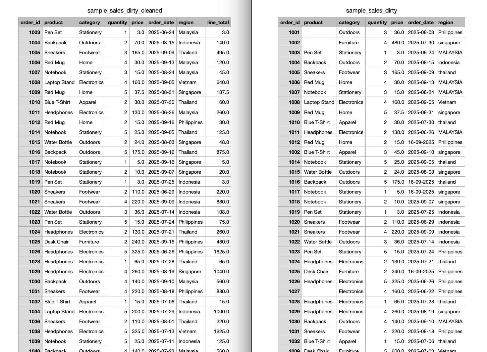

# 🛠️ Retail ETL Pipeline (AWS → Snowflake → Dashboard)

## 📌 Project Overview

A fully automated, cloud-native ETL pipeline that processes retail sales data from raw CSV files to interactive analytics dashboards. This project demonstrates modern data engineering practices using AWS services and Snowflake for scalable data processing and visualization.

**🎯 Achievement:** Successfully built an end-to-end automated data pipeline that transforms dirty sales data into actionable business insights.

---

## 🏗️ Architecture



**Data Flow:**
```
Raw CSV Upload → AWS S3 (/raw/) → Lambda ETL Processing → S3 (/cleaned/) → 
Snowflake Data Warehouse → Interactive Snowsight Dashboard
```

---

## ✨ Key Features

- **🔄 Event-Driven Processing**: S3 upload automatically triggers Lambda ETL
- **🧹 Advanced Data Cleaning**: Deduplication, validation, and standardization
- **📊 Real-time Analytics**: Interactive dashboard with 5 visualization types
- **☁️ Serverless Architecture**: Cost-effective, scalable AWS Lambda processing
- **📈 Business Intelligence**: Sales trends, regional performance, product analysis

---

## 🎯 What We Built

### **ETL Processing Engine**
- **Lambda Function**: Python ETL logic with pandas for data transformation
- **Data Cleaning**: Handles duplicates, missing values, format inconsistencies
- **S3 Integration**: Seamless processing between raw and cleaned buckets

### **Data Warehouse & Analytics**
- **Snowflake Setup**: Complete warehouse, database, and schema configuration
- **External Stages**: S3-Snowflake integration for automated data loading
- **Interactive Dashboard**: 5-chart analytics dashboard in Snowsight

### **Sample Data & Testing**
- **Dirty Data Generator**: Custom Python script creates realistic messy datasets
- **150+ Records**: E-commerce transactions across multiple regions and categories

---

## 📸 Project Screenshots

| Component | Screenshot | Description |
|-----------|------------|-------------|
| **S3 Structure** |  | Raw & cleaned data organization |
| **Lambda Function** |  | ETL processing code |
| **Analytics Dashboard** |  | Complete 5-chart dashboard |
| **Data Transformation** |  | Raw vs cleaned data |

---

## 🚀 How to Run

### **Step 1: Upload Data**
```bash
aws s3 cp your_file.csv s3://etl-retail-ayush1/raw/
```

### **Step 2: Automatic Processing**
- Lambda triggers automatically on S3 upload
- Data is cleaned and saved to `/cleaned/` folder

### **Step 3: Load to Snowflake**
```sql
COPY INTO sales_cleaned FROM @cleaned_stage
FILE_FORMAT = (TYPE = CSV SKIP_HEADER=1);
```

### **Step 4: View Dashboard**
- Open Snowsight → "Retail ETL Dashboard"
- View real-time analytics and insights

---

## 🛠️ Tech Stack

| Component | Technology | Purpose |
|-----------|------------|---------|
| **Storage** | AWS S3 | Raw and cleaned data storage |
| **Processing** | AWS Lambda (Python) | ETL transformation |
| **Data Warehouse** | Snowflake | Analytics and querying |
| **Visualization** | Snowsight | Interactive dashboards |
| **Orchestration** | S3 Event Triggers | Automated pipeline |

---

## 📁 Project Structure

```
etl-project/
├── data/                          # Sample datasets
│   ├── sample_sales_dirty.csv     # Raw test data (150+ records)
│   └── sample_sales_dirty_cleaned.csv  # Processed data
├── diagrams/                          # Project Screenshots
│   ├── s3_structure.png
│   ├── lambda_code.png
│   ├── dashboard.png
│   └── before_after_s3.png
├── scripts/
│   ├── generate_dirty_data.py     # Data generator for testing
│   └── lambda/
│       └── lambda_function.py     # AWS Lambda ETL code
├── diagrams/
│   └── etl_pipeline.png          # Architecture diagram
├── requirements.txt              # Python dependencies
└── README.md                     # This file
```

---

## 🚀 Quick Setup

### **Prerequisites**
- AWS Account (S3, Lambda access)
- Snowflake account
- Python 3.8+

### **Installation**
```bash
git clone https://github.com/ayu43sharma/ETL-Pipeline.git
cd etl-project
pip install -r requirements.txt
cp .env.template .env  # Configure your credentials
```

### **Generate Test Data**
```bash
cd scripts
python generate_dirty_data.py
```

---

## 🔧 Configuration

Create `.env` file with your credentials:
```bash
# AWS Configuration
AWS_ACCESS_KEY_ID=your_access_key
AWS_SECRET_ACCESS_KEY=your_secret_key
AWS_REGION=ap-southeast-1

# Snowflake Configuration
SNOWFLAKE_ACCOUNT=your_account
SNOWFLAKE_USER=your_username
SNOWFLAKE_PASSWORD=your_password
```

---

## 🚀 Future Enhancements

- [ ] Data quality monitoring alerts
- [ ] Incremental loading strategies
- [ ] Advanced analytics (ML predictions)
- [ ] Mobile-responsive dashboards
- [ ] Automated testing framework
